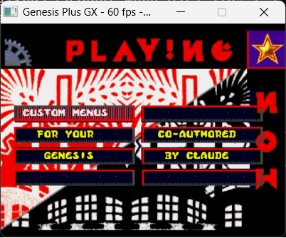
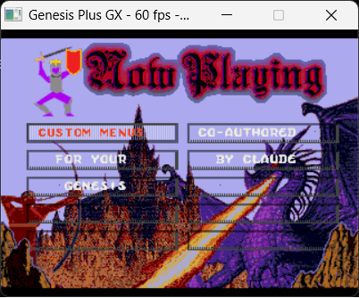
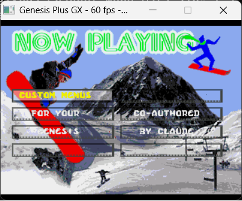
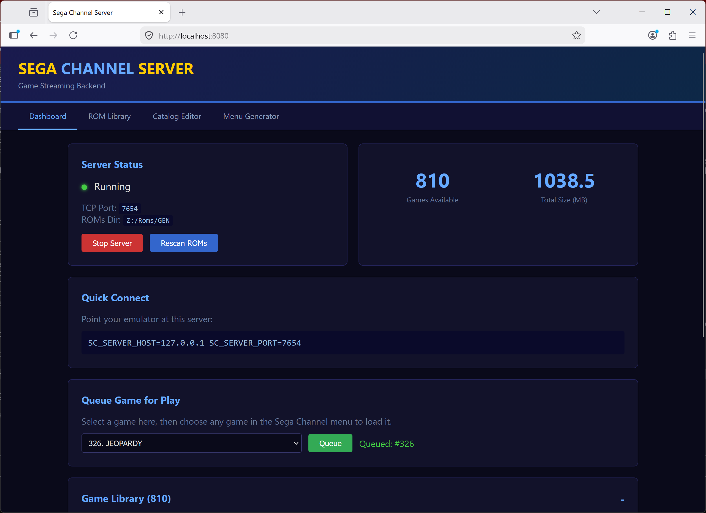

# Sega Channel Revival

**Bringing back the magic of Sega Channel -- the world's first video game streaming service.**



Back in 1994, Sega did something nobody else was doing: they streamed Genesis games directly to your TV through your cable connection. No cartridges. No trips to the store. Just a special adapter in your cartridge slot, a monthly subscription, and 50 games rotating every month. It was actual magic.

This project reverse-engineers the Sega Channel adapter hardware and builds a modern backend server so the original menu ROMs can browse, select, and play games -- streamed from your own collection.

## Custom Menus on Real Sega Channel ROMs

The ROM patcher works with any of the original monthly menu ROMs, each with its own seasonal theme:




Every month brought a different look -- medieval castles with knights and dragons, snowboarding mountains, movie theaters, spinning pumpkins for Halloween, autumn leaves for Thanksgiving. The ROM patcher preserves all of these original animations and graphics while letting you customize the game list.

## What's Here

### Backend Server (`server/`)
A Python server that replaces the cable TV headend. It serves your ROM library to the emulator over TCP.

- **810+ games** loaded directly from zipped ROM files
- **Web management UI** at `http://localhost:8080`
- Game catalog, ROM library browser, queue system
- Custom SCMENU.BIN generator



### Visual ROM Editor (Web UI)
Upload any Sega Channel menu ROM and edit it visually in your browser. The editor shows the full menu structure — categories on the left, edit panel on the right. Click any entry to rename it, assign a game from your 810+ ROM library, and export the patched ROM.

- Upload any SC menu ROM (US, Canadian, PAL, prototype)
- See all 60 entries: 10 categories + 50 games, color-coded
- Edit titles with live character count vs field limit
- Assign server game IDs from a searchable dropdown
- Export patched ROM — preserves original theme and animations
- Works with all monthly menu variants (dragon, snowboard, theater, pumpkins...)

Access at `http://localhost:8080/editor`

### ROM Patcher (`tools/rom_patcher.py`)
Command-line tool for batch patching. Takes a JSON catalog and patches all entries at once. Works with all known SC ROM variants.

```bash
python tools/rom_patcher.py \
  --rom "US Menu Demo 1997C.BIN" \
  --catalog server/patch_catalog.json \
  --output SegaChannel_Custom.bin
```

### Hardware Analysis (`docs/`, `tools/`)
Complete reverse-engineering of the Sega Channel adapter:

- **Register map**: Bank switching ($A130F0-FA), data port ($A13040), status ($A13042), SRAM overlay
- **Serial protocol**: Adapter-to-tuner communication via Genesis serial port
- **Comm buffer**: $FFE1A8 protocol for game selection and download signaling
- **SCMENU.BIN format**: Entry table structure, category/game records, pointer layout
- **Entry table**: Full mapping of all 160 entries (10 categories, 50 games, 100+ expanded content blocks)

All decoded from the original ROM dumps using Python + Capstone m68k disassembler.

## Quick Start

```bash
# 1. Start the server (point at your ROM collection)
cd server
python web_app.py --roms /path/to/genesis/roms --auto-start

# 2. Open the web UI
# http://localhost:8080

# 3. Run the emulator with a Sega Channel ROM
# (Use our Genesis Plus GX fork with SC adapter support)
SC_SERVER_HOST=127.0.0.1 SC_SERVER_PORT=7654 \
  ./gen_sdl2 SegaChannel_Custom.bin
```

## The Sega Channel Experience

If you were lucky enough to have Sega Channel as a kid, you remember the rotating monthly menus -- each one themed for the season. Spinning pumpkins for Halloween. Knights and dragons. Snowboarders carving down mountains. A movie theater marquee. Every month brought new games and a fresh look.

You remember browsing categories like **"The Arcade"**, **"Sports Arena"**, **"The Dungeon"** and picking from 50 games that were right there, ready to play. No waiting for downloads (okay, maybe a little). No cartridge swapping. Just pure, streamed Genesis gaming.

This project exists to celebrate all of that. Sega Channel was a beautiful oddity -- way ahead of its time, gone too soon, and remembered fondly by everyone who had one.

## Architecture

```
[Web UI :8080] --> [Flask Server] --> manage ROMs, queue games
                        |
              [TCP Server :7654] <--> [Genesis Plus GX + SC Adapter]
                        |                        |
                   ROM Library              Menu ROM boots from DRAM
                   (zipped ROMs)            Games fetched on demand
                                            Backspace = return to menu
```

## Credits & Acknowledgments

### ROM Preservation

None of this would be possible without the incredible work of the **[Video Game History Foundation (VGHF)](https://gamehistory.org/segachannel/)** and their collaborators who recovered **144 unique Sega Channel ROMs** -- system menus, exclusive games, prototypes, and variants that were very nearly lost forever.

Special thanks to:

- **Michael Shorrock** -- Former Sega Channel Vice President of Programming, who donated his personal collection
- **Ray ("Sega Channel Guy")** -- Community member who tracked down former Sega Channel staff and obtained tape backups containing the original data
- **Chuck Guzis / Sydex** -- Data tape expert who digitized Ray's tape backups (in memoriam)
- **RisingFromRuins & Nathan Misner (infochunk)** -- Cracked the Sega Channel data formats to extract the ROMs
- **Dustin Hubbard (Hubz) / [Gaming Alexandria](https://www.gamingalexandria.com/)** -- Hosts and shares the recovered ROM data
- **[Sega Retro](https://segaretro.org/)**, **[The Cutting Room Floor](https://tcrf.net/)**, and **[Hidden Palace](https://hiddenpalace.org/)** -- For documenting everything known about Sega Channel

The full story: ["Don't Just Watch TV: The Secrets of Sega Channel"](https://gamehistory.org/segachannel/) by Phil Salvador, VGHF.

### Original Development

The Sega Channel system software was developed by **Pacific SoftScape Inc.** (1994-1997).

Sega Channel was a joint venture between Sega of America, Time Warner Cable, and TCI. The service operated from 1994 to 1998.

## Related

- **[Genesis Plus GX - Sega Channel Fork](https://github.com/sp00nznet/genesis-plus-gx-sega-channel)** -- Our emulator fork with the Sega Channel adapter mapper
- **[SGDK](https://github.com/Stephane-D/sgdk)** -- Sega Genesis Development Kit (stretch goal: custom SC ROM from scratch)
- **[VGHF Sega Channel Article](https://gamehistory.org/segachannel/)** -- The full preservation story

---

*"Now Playing" never gets old.*
