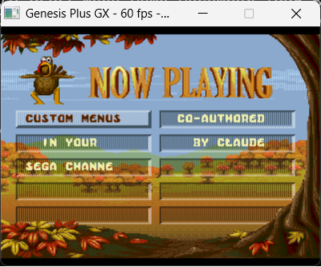

# Sega Channel Revival

**Bringing back the magic of Sega Channel -- the world's first video game streaming service.**



Back in 1994, Sega did something nobody else was doing: they streamed Genesis games directly to your TV through your cable connection. No cartridges. No trips to the store. Just a special adapter in your cartridge slot, a monthly subscription, and 50 games rotating every month. It was actual magic.

This project reverse-engineers the Sega Channel adapter hardware and builds a modern backend server so the original menu ROMs can browse, select, and play games -- streamed from your own collection.

## What's Here

### Backend Server (`server/`)
A Python server that replaces the cable TV headend. It serves your ROM library to the emulator over TCP.

- **810+ games** loaded directly from zipped ROM files
- **Web management UI** at `http://localhost:8080`
- Game catalog, ROM library browser, queue system
- Custom SCMENU.BIN generator


### ROM Patcher (`tools/rom_patcher.py`)
Patches any Sega Channel menu ROM to display your own custom categories and game titles. The original display engine, graphics, and Sega Channel animations are preserved -- only the text changes.

```bash
python tools/rom_patcher.py \
  --rom "Canada Menu Demo December 1995.BIN" \
  --catalog server/patch_catalog.json \
  --output SegaChannel_Custom.bin
```

### Hardware Analysis (`docs/`, `tools/`)
Complete reverse-engineering of the Sega Channel adapter:

- **Register map**: Bank switching ($A130F0-FA), data port ($A13040), status ($A13042), SRAM overlay
- **Serial protocol**: Adapter-to-tuner communication via Genesis serial port
- **Comm buffer**: $FFE1A8 protocol for game selection and download signaling  
- **SCMENU.BIN format**: Entry table structure, category/game records, pointer layout
- **Bytecode interpreter**: Pacific SoftScape's display engine and script system

All decoded from the original ROM dumps using Python + Capstone m68k disassembler.

## Quick Start

```bash
# 1. Start the server (point at your ROM collection)
cd server
python web_app.py --roms /path/to/genesis/roms --auto-start

# 2. Open the web UI
# http://localhost:8080

# 3. Run the emulator with a Sega Channel ROM
# (Use our Genesis Plus GX fork with SC adapter support)
SC_SERVER_HOST=127.0.0.1 SC_SERVER_PORT=7654 \
  ./gen_sdl2 SegaChannel_Custom.bin
```

## The Sega Channel Experience

If you were lucky enough to have Sega Channel as a kid, you remember:

- The **Thanksgiving menu** with its autumn leaves and turkey
- Browsing categories like **"The Arcade"**, **"Sports Arena"**, **"The Dungeon"**
- The download screen showing game tips while your game loaded
- Playing **Jeopardy** with your family, streamed from the local cable company
- That feeling when the monthly lineup changed and there were new games

This project exists to celebrate all of that. Sega Channel was a beautiful oddity -- way ahead of its time, gone too soon, and remembered fondly by everyone who had one.

## Architecture

```
[Web UI :8080] --> [Flask Server] --> manage ROMs, queue games
                        |
              [TCP Server :7654] <--> [Genesis Plus GX + SC Adapter]
                        |                        |
                   ROM Library              Menu ROM boots from DRAM
                   (zipped ROMs)            Games fetched on demand
                                            Backspace = return to menu
```

## Related

- **[Genesis Plus GX - Sega Channel Fork](https://github.com/sp00nznet/genesis-plus-gx-sega-channel)** -- Our emulator fork with the Sega Channel adapter mapper
- **[SGDK](https://github.com/Stephane-D/sgdk)** -- Sega Genesis Development Kit (stretch goal: custom SC ROM from scratch)

## Credits

Reverse-engineered from Sega Channel menu ROM dumps originally developed by **Pacific SoftScape Inc.** (1994-1997).

Sega Channel was a joint venture between Sega, Time Warner Cable, and TCI.

---

*"Now Playing" never gets old.*
